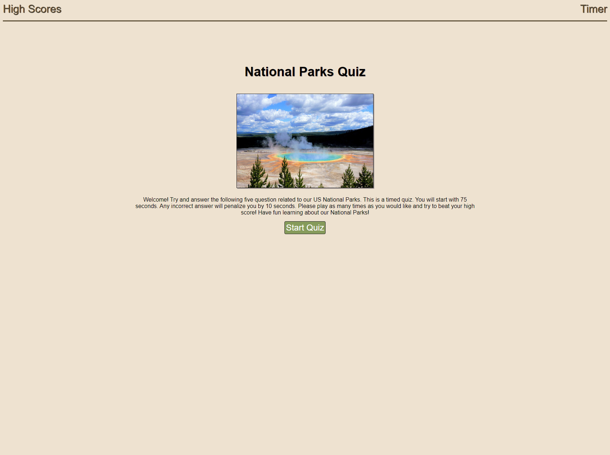

# National Parks Quiz Game

## Description

This project is a fun, timed, multiple choice quiz game that that asks the user to select the correct answer for five questions related to our National Parks. If the incorrect answer is selected, a time penalty is applied to the countdown timer. At the end of the game, the user can enter their initials and submit their high score. A list of high scores will be locally stored so that they can be viewed.

Link to application:

https://kevinsmithseven.github.io/national-parks-quiz-game/

## Usage

Upon page load, the start screen will appear and describe the quiz. Once the user clicks the "Start Quiz" button, they will be taken to the first question and the timer will start counting down from 75 seconds. If they select the wrong answer, a 10 second penalty will be deducted from the timer. Once they have answered all five questions, or if the timer reaches zero, the quiz will end. The user will be able to enter their initials and submit their score. At any point, the high score link on the screen will show a list of high scores submitted previously.

    

## Credits

Special thanks to Dominique Meeks Gombe, who provided tutoring and guidance to me while I was working on this project.

In completing this project, I utilized the below resources to assist:

https://www.w3schools.com/  
https://developer.mozilla.org/en-US/docs/Web/JavaScript/Reference/Template_literals  
https://developer.mozilla.org/en-US/docs/Web/API/setInterval  
https://coding-boot-camp.github.io/full-stack/github/professional-readme-guide  
https://www.markdownguide.org/basic-syntax/  
https://unsplash.com/  

Image contributor: Meina Yin

## Badges

## How to Contribute

If you wish to contribute to this project, please reach out to the author.

